<h1 align="center" id="title">SMART HEALTHCARE SYSTEM</h1>

<a href="https://github.com/ShanelkaPramuditha/smart-healthcare-system/graphs/contributors">
    
  
</a>

## <b>Project Highlights</b> 

Appointment Management: Simple scheduling, updating, and viewing of appointments for users. 
Billing & Payments: Efficient payment processing with multiple options like cash and card. 
Data Analytics: Detailed insights for admins, including visual reports and metrics. 
Patient Management: Secure handling of patient data and medical records.

## Logo

## Screenshots

  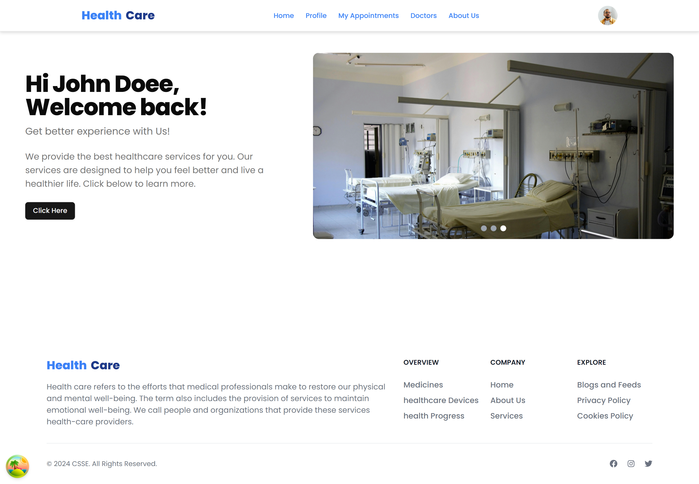
  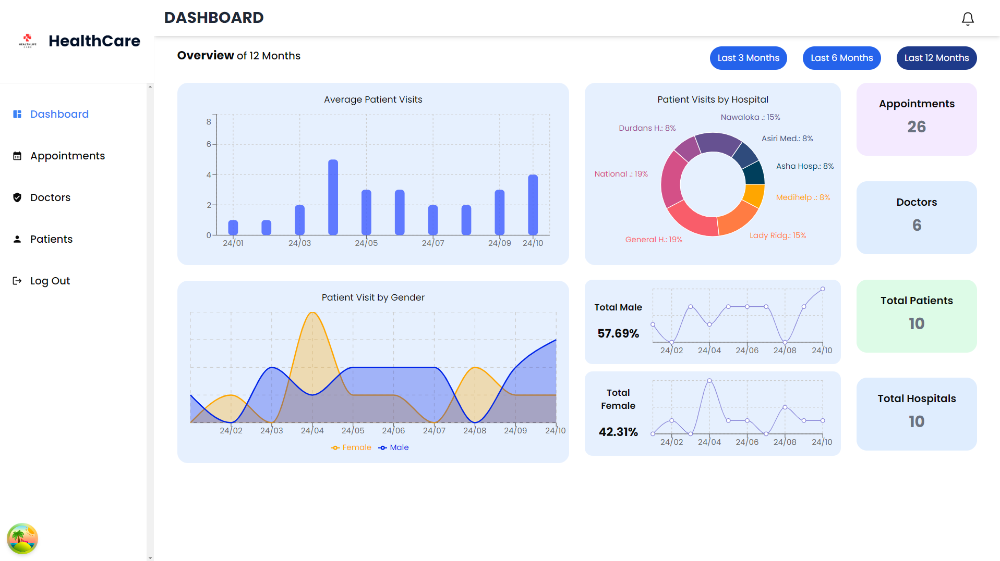
  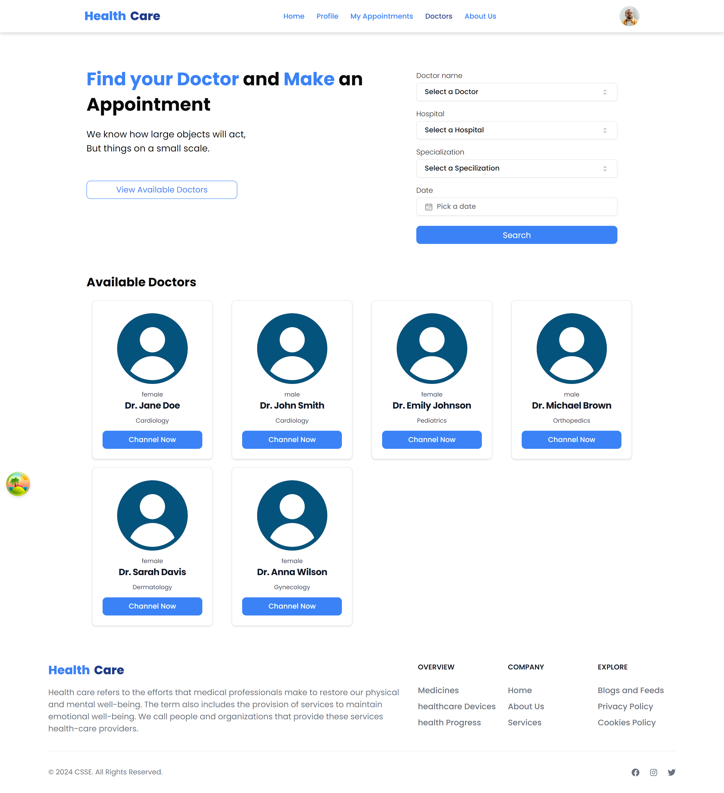
  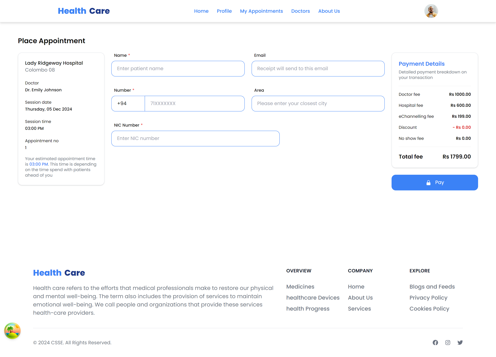
  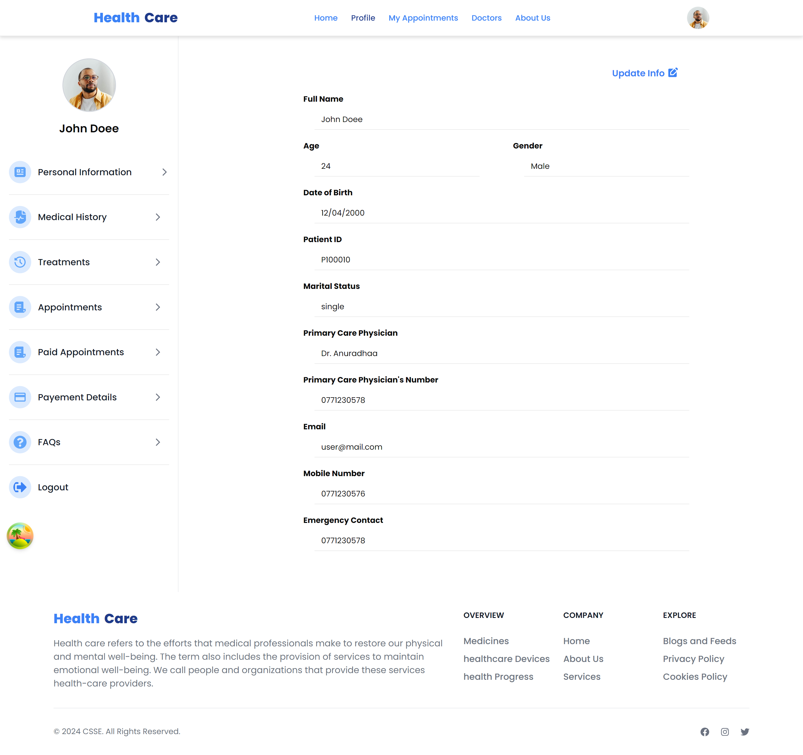
  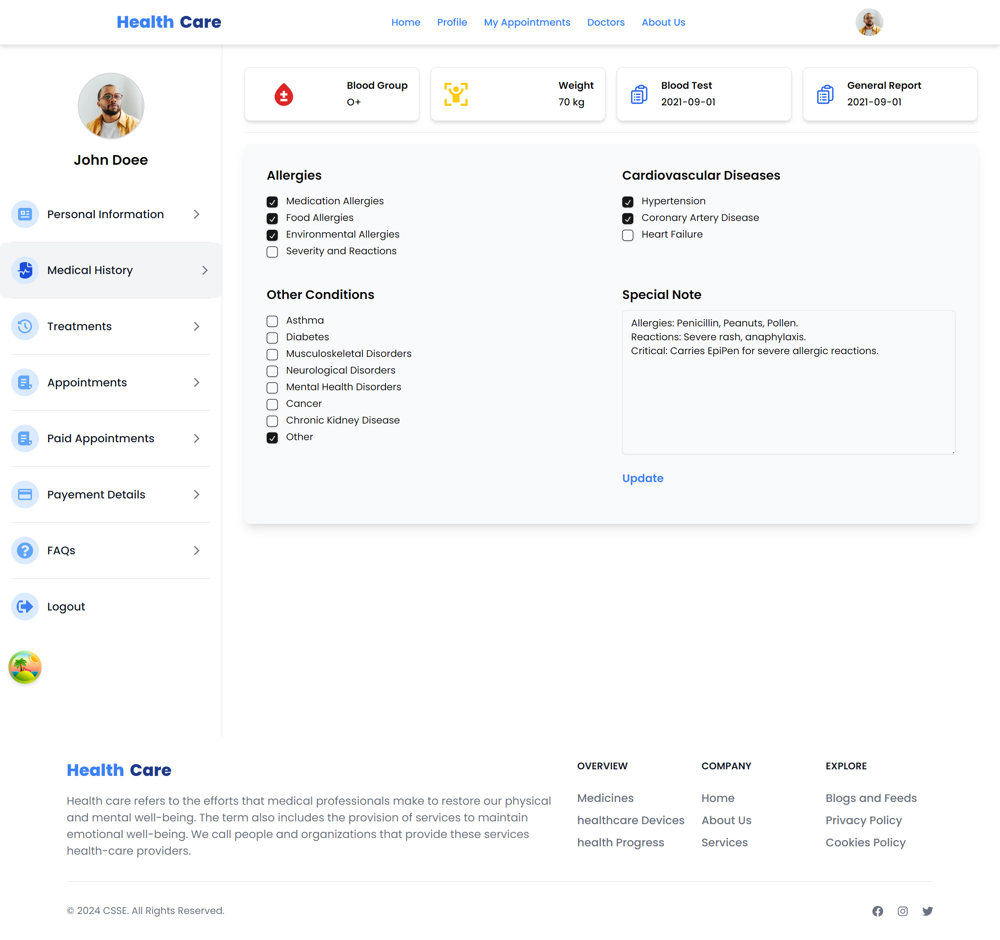
  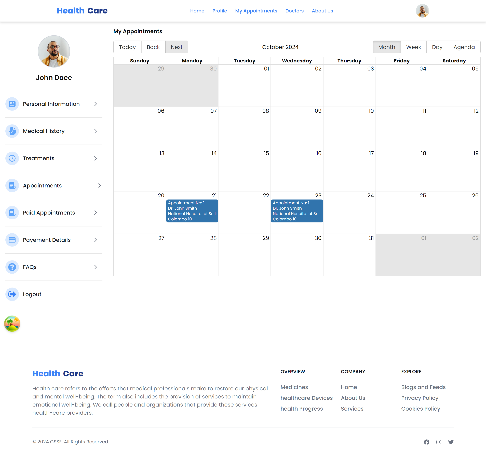
  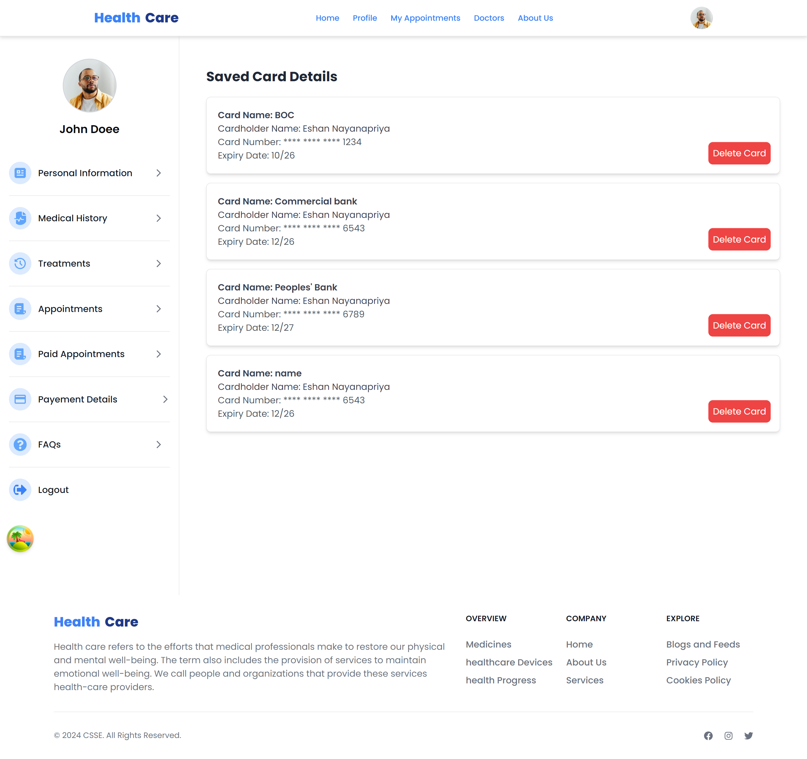
  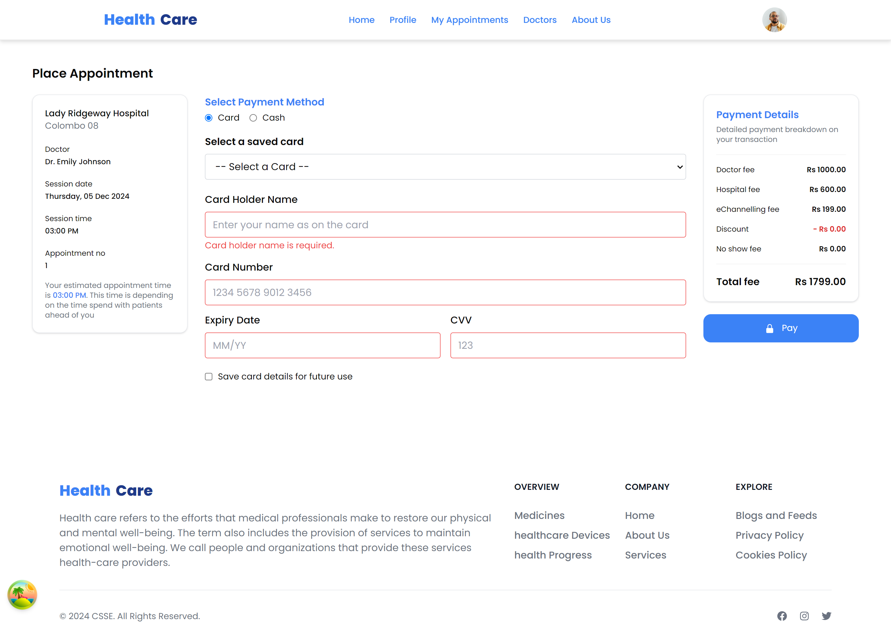
  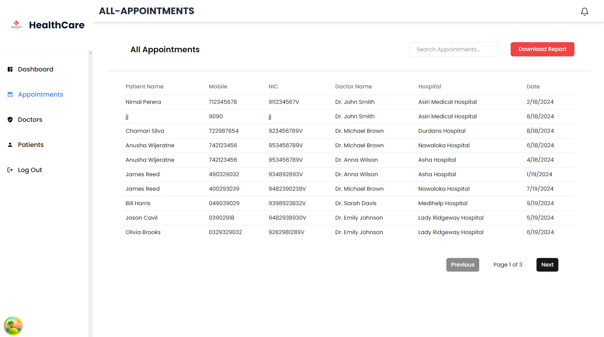
  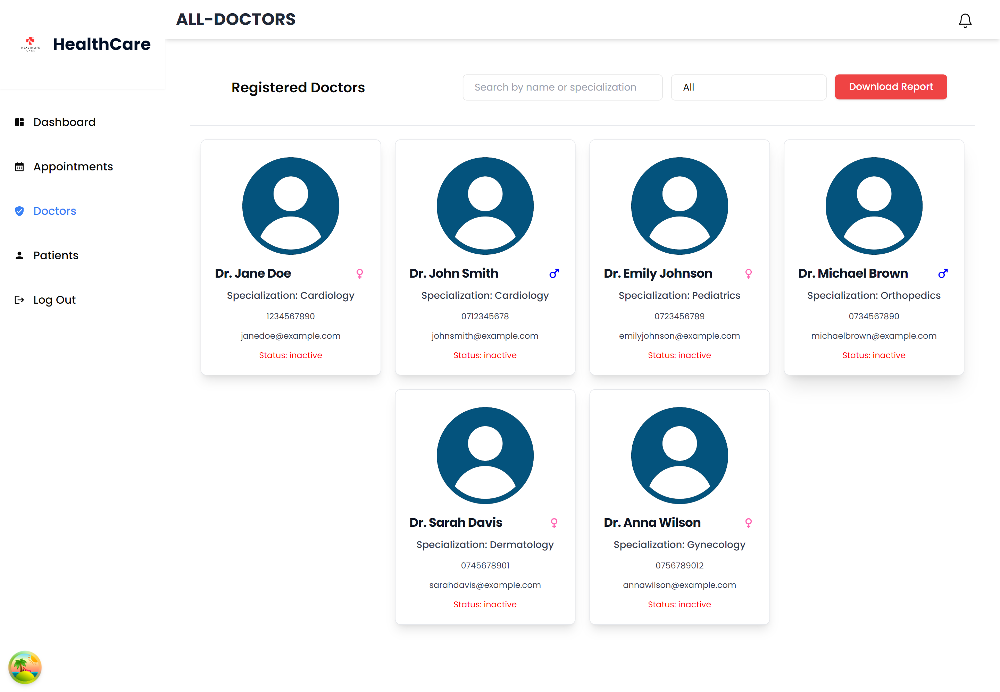
  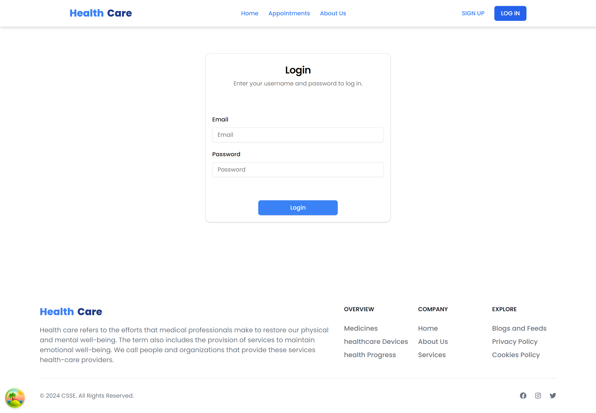
  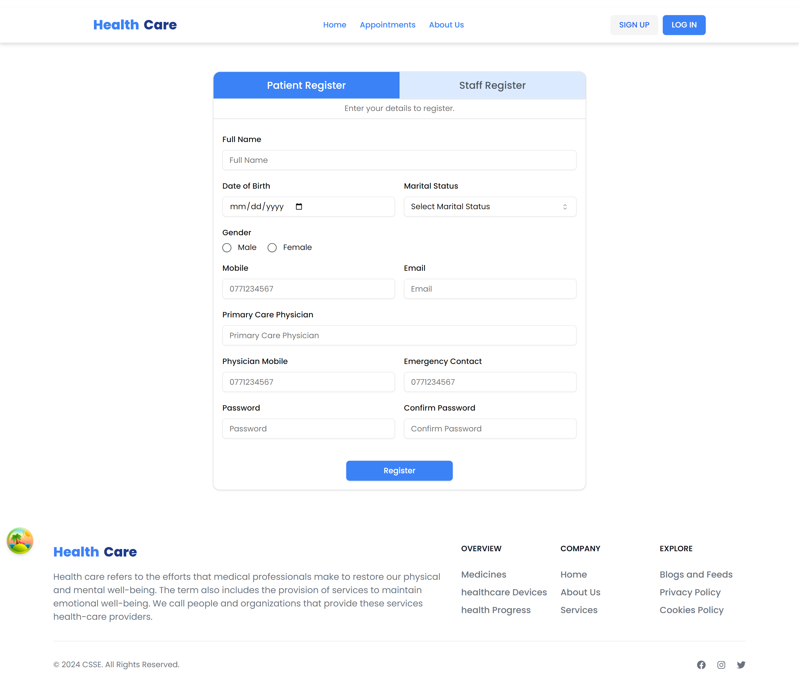

